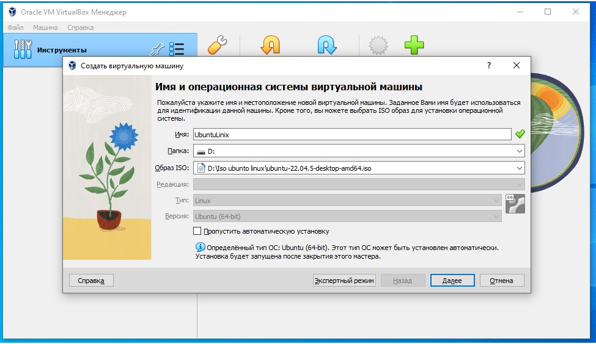
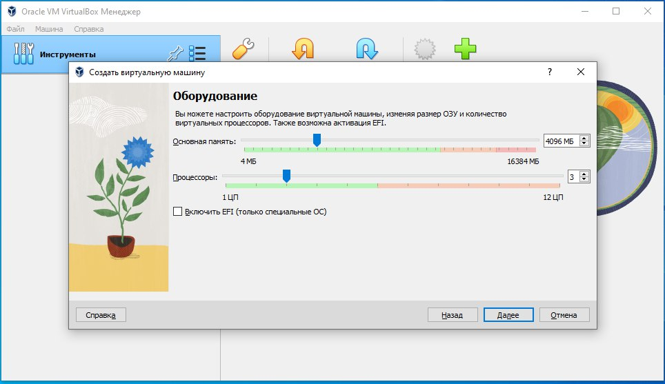
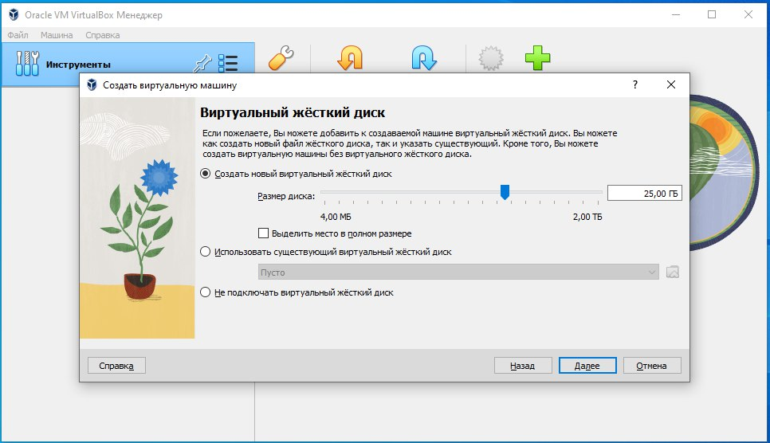
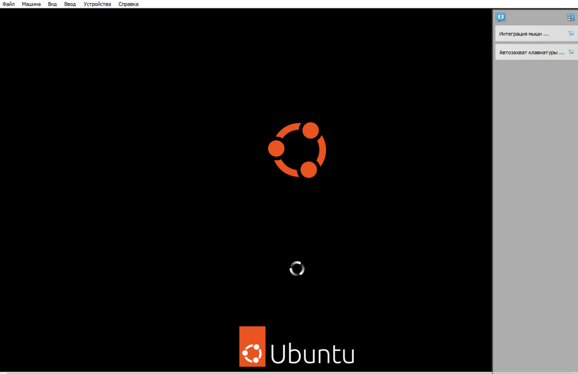
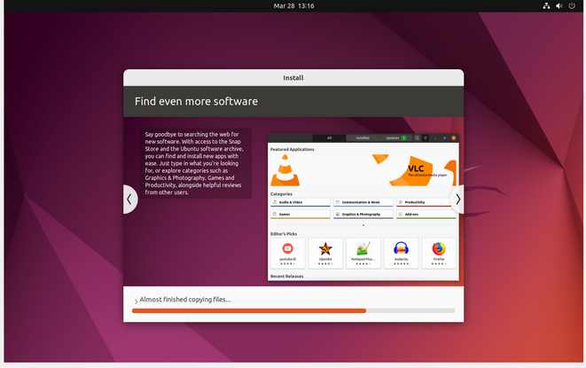
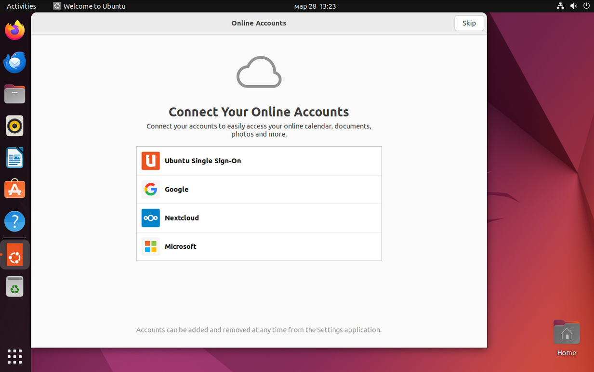
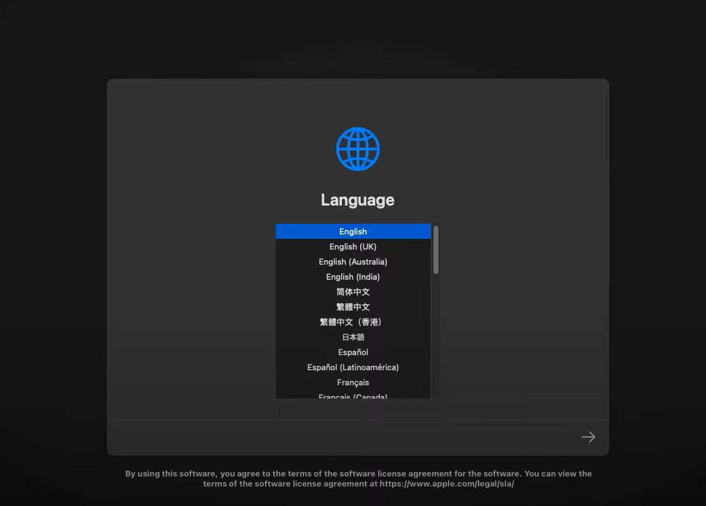
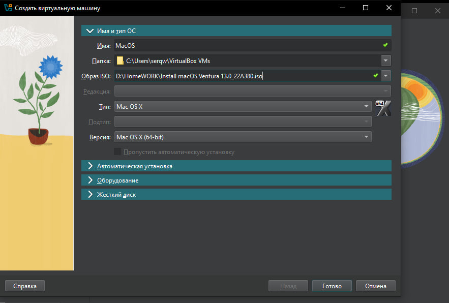

# Практическое задание: Работа с виртуализацией (VirtualBox)

## Цель
Ознакомиться с технологией виртуализации, научиться создавать и настраивать виртуальные машины с помощью VirtualBox, а также установить и настроить различные операционные системы в виртуальной среде.

## Задание 1: Установка VirtualBox и создание виртуальной машины

### Установка VirtualBox
1. Загрузите и установите последнюю версию VirtualBox на ваш компьютер.
2. Убедитесь, что VirtualBox успешно запускается и функционирует.
- 

### Создание виртуальной машины
1. Создайте новую виртуальную машину для установки операционной системы Mac или Linux (например, Ubuntu).

2. Настройте параметры виртуальной машины: назначьте необходимое количество оперативной памяти и создайте виртуальный жесткий диск.

## Задание 2: Установка операционной системы в виртуальной машине

### Установка Mac
1. Загрузите образ ISO Mac.
2. Установите Mac в созданной виртуальной машине.
3. Настройте сетевые подключения и подключите интернет.

### Установка Linux (Ubuntu)
1. Загрузите образ ISO Ubuntu.
2. Установите Ubuntu в отдельной виртуальной машине.
3. Настройте сетевые подключения и подключите интернет.

## Задание 3: Настройка и сравнение операционных систем

### Настройка ОС
1. Установите необходимые драйверы и обновления для каждой ОС.
2. Настройте пользовательский интерфейс и базовые настройки системы.

### Сравнительный анализ

#### 1. Сравнение особенностей, производительности и удобства использования Mac и Ubuntu в виртуальной среде

**Mac OS:**
- **Особенности:**
  - Интуитивно понятный интерфейс, ориентированный на пользователя.
  - Высокая степень интеграции с устройствами Apple.
  - Поддержка множества профессиональных приложений.

- **Производительность:**
  - В виртуальной среде может требовать значительных ресурсов (оперативная память, процессор).
  - Возможны проблемы с драйверами и совместимостью оборудования.

- **Удобство использования:**
  - Удобный и привлекательный интерфейс.
  - Легкость в настройке и использовании для пользователей, знакомых с экосистемой Apple.

**Ubuntu (Linux):**
- **Особенности:**
  - Открытый исходный код, высокая степень настройки.
  - Широкий выбор программного обеспечения и инструментов.
  - Поддержка командной строки для продвинутых пользователей.

- **Производительность:**
  - Более эффективное использование ресурсов по сравнению с Mac OS в виртуальной среде.
  - Возможность работы на менее мощном оборудовании.

- **Удобство использования:**
  - Интерфейс может быть менее интуитивным для новых пользователей.
  - Требует больше времени на настройку и освоение.

#### 2. Преимущества и недостатки использования виртуальных машин для работы с разными ОС

**Преимущества:**
- **Гибкость:** Возможность запуска нескольких операционных систем на одном физическом компьютере.
- **Изоляция:** Виртуальные машины изолированы друг от друга, что повышает безопасность.
- **Тестирование и разработка:** Удобно для тестирования программного обеспечения в разных средах.
- **Экономия ресурсов:** Нет необходимости в отдельном оборудовании для каждой ОС.

**Недостатки:**
- **Производительность:** Виртуальные машины могут работать медленнее по сравнению с нативной установкой ОС.
- **Ресурсоемкость:** Требует значительных вычислительных ресурсов для одновременной работы нескольких ОС.
- **Сложность настройки:** Настройка и управление виртуальными машинами может быть сложным для новичков.
- **Совместимость:** Возможны проблемы с драйверами и совместимостью оборудования.

## Задание 4: Настройка сетевых подключений в VirtualBox

### Настройка NAT
1. Создайте виртуальную машину с сетевым адаптером, настроенным на NAT.
2. Проверьте доступ к интернету из виртуальной машины.

### Настройка Bridged
1. Измените сетевой адаптер на Bridged.
2. Проверьте доступ к локальной сети и интернету.

## Задание 5: Управление ресурсами виртуальной машины

### Управление оперативной памятью
1. Измените объем оперативной памяти, выделенной виртуальной машине.
2. Проверьте влияние на производительность.

### Управление процессорами
1. Измените количество ядер процессора, доступных виртуальной машине.
2. Проверьте влияние на производительность.

